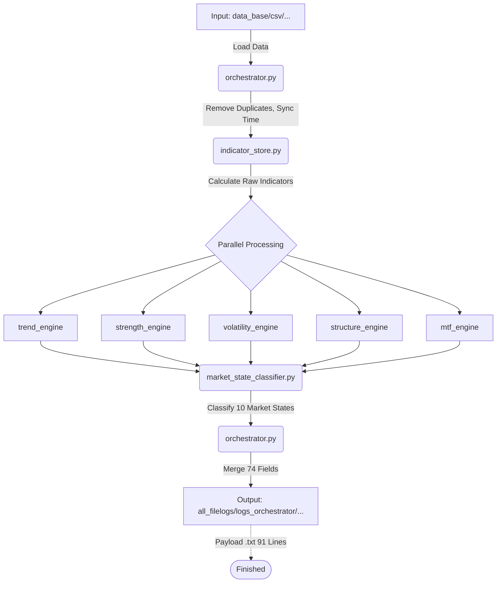

# 🧠 FINALBOT - กระบวนการทำงานของบอท ส่วนที่ 2: PROCESS (Data Evaluate)

## 🎯 ทำความเข้าใจได้ทันที
ส่วนงานที่ 2 (PROCESS) คือ **"สมองกลวิเคราะห์ข้อมูล"** ที่ตั้งอยู่ในโฟลเดอร์ `data_evaluate/` มีหน้าที่รับไม้ต่อจากส่วนที่ 1 โดยการดึงไฟล์ `.csv` (ข้อมูลดิบ) มาคำนวณผ่านอินดิเคเตอร์และโมเดลคณิตศาสตร์ เพื่อสร้างเป็น **"แพ็กเกจข้อมูล 74 ฟิลด์ (ความยาว 91 บรรทัด) (Payload)"** สำหรับส่งต่อให้ AI (ส่วนที่ 3) นำไปตัดสินใจ โดยส่วนงานที่ 2 จะทำหน้าที่แค่ "วิเคราะห์และรายงานผล" เท่านั้น จะไม่มีการตัดสินใจยิงออร์เดอร์ใดๆ ทั้งสิ้น

---

## 🏗️ โครงสร้างหลักของโปรเจกต์และขอบเขตส่วนงาน

**โครงสร้างหลักของโปรเจกต์:**
- `main.py` คือไฟล์หลักจุดเริ่มต้น
- `runner.py` คือผู้ควบคุมทิศทาง
- `config_setting/` คือโฟลเดอร์สำหรับเก็บไฟล์การตั้งค่าทั้งหมด

**ขอบเขตและที่ตั้งของส่วนงาน:**
- **ส่วนงานที่ 1 (Data Feed):** โค้ดทุกไฟล์ต้องอยู่ในโฟลเดอร์ `data_feed/` เท่านั้น และจบการทำงานตรงที่มีไฟล์ OHLCV แบบ `.csv` ในโฟลเดอร์ที่กำหนด
- **ส่วนงานที่ 2 (Data Evaluate):** โค้ดทุกไฟล์ต้องอยู่ในโฟลเดอร์ `data_evaluate/` เท่านั้น และจบการทำงานตรงที่มีไฟล์ Payload 91 บรรทัด .txt ในโฟลเดอร์ที่กำหนด
- **ส่วนงานที่ 3:** ยังไม่ต้องกล่าวถึง

---

## 🚨 กฎการทำงานและกติกาข้อบังคับ (Strict Rules)

1. **ห้ามเชื่อมต่อกับระบบเก่า (No Legacy Dependencies):** 
   - ห้ามมีการดึงข้อมูล (Import) หรือเรียกใช้งานคลาสใดๆ จากโฟลเดอร์ `core/` เด็ดขาด ระบบใน `data_evaluate/` ต้องเป็นเอกเทศและทำงานได้ด้วยตัวเอง 100%

2. **ดึงข้อมูลจากแหล่งเดียว (Single Source of Truth):**
   - ส่วนงานที่ 2 ต้องดึงข้อมูล OHLCV โดยตรงจากไฟล์ `.csv` ที่ส่วนงานที่ 1 ผลิตออกมาเท่านั้น ห้ามสร้างกระบวนการดึงข้อมูลจาก Broker ขึ้นมาซ้ำซ้อน

3. **กฎการแตกหัก (Fail-Fast Policy & No Silent Failures):**
   - หากเจอข้อผิดพลาดของข้อมูล (เช่น ไฟล์ CSV ไม่สมบูรณ์, คำนวณค่าอินดิเคเตอร์ไม่ได้) ให้ระบบแจ้ง Error และ **"หยุดการทำงานทันที"** 
   - ห้ามใช้ `try-except` เพื่อซ่อน Error (หมกเม็ด) และห้ามมีระบบ Fallback หรือค่าตัวแทนเด็ดขาด

4. **ซื่อสัตย์เรื่อง Type และ ห้ามแอบแก้ข้อมูลต้นฉบับ (Immutability):**
   - ห้ามแก้ไขตัวแปรต้นฉบับที่ส่งเข้ามา ให้สร้างดิกชันนารี (Dictionary) หรือชุดข้อมูลใหม่สำหรับเก็บผลลัพธ์การคำนวณเท่านั้น

5. **ไม่ใช่ผู้ตัดสินใจขั้นสุดท้าย (Not the Executioner):**
   - ส่วนงานที่ 2 ห้ามออกคำสั่งเทรด (BUY/SELL) หรือยิงออร์เดอร์โดยพลการ หน้าที่ของส่วนนี้จะสิ้นสุดเมื่อสามารถสร้างเอกสาร Payload 74 ฟิลด์ (ความยาว 91 บรรทัด) (ที่มีสถานะเป็น "รอการวิเคราะห์จาก AI") ได้สำเร็จเท่านั้น

6. **ห้ามมี Mock เด็ดขาด (No Mocks):**
   - การคำนวณ ข้อมูล และเครื่องมือต่างๆ (Advanced Tools) ต้องเป็นของการพัฒนาใช้งานจริง (Real Implementation) เท่านั้น ห้ามจำลองสถานการณ์หรือใช้ข้อมูลสมมุติ (Mock Data) ขึ้นมาเพื่อหลอกระบบโดยเด็ดขาด

7. **บทบาทของ Athena (ข้อจำกัดการทำงาน):**
   - เอเธน่ามีหน้าที่เป็นเลขาและผู้ประสานงานเท่านั้น **ห้ามแก้ไข ลบ หรือเพิ่มซอร์สโค้ดใดๆ ด้วยตัวเองอย่างเด็ดขาด** หากมีงานที่เกี่ยวข้องกับการเขียนหรือแก้โค้ด ต้องสั่งการให้ Agent (เช่น gg, ds, หรือ skill) เป็นผู้ดำเนินการแทนเสมอ

---

## 🏗️ โครงสร้างระบบ Data Evaluate

### ภาพรวมสถาปัตยกรรมกระบวนการ



### ไฟล์ที่ทำงานร่วมกัน

```
Data Evaluate System = ระบบประเมินและวิเคราะห์ข้อมูล (Single Source of Truth)
├── orchestrator.py            → ศูนย์กลางควบคุมการโหลด CSV และจัดการ Data Flow (👑)
├── indicator_store.py         → ทำหน้าที่เป็น Facade เรียกใช้งาน 2 ไฟล์ด้านล่าง (ตามหลัก Single Responsibility)
├── core_indicators.py         → คำนวณสูตรคณิตศาสตร์พื้นฐาน เช่น EMA, RSI, MACD, BB
├── structural_metrics.py      → คำนวณสูตรเชิงโครงสร้าง เช่น ATR, ADX, Slope, Volume Ratio
├── trend_engine.py            → Engine ประเมินทิศทางและกำลังแนวโน้ม
├── strength_engine.py         → Engine ประเมินโมเมนตัม
├── volatility_engine.py       → Engine ประเมินความผันผวนของราคา
├── structure_engine.py        → Engine ประเมินแนวรับแนวต้านและโครงสร้างกราฟ
├── mtf_engine.py              → Engine ประเมินความสอดคล้องข้าม Timeframe
└── market_state_classifier.py → คลาสสิฟาย 10 สภาวะตลาดจาก 5 Engines
```

### ควบคุมการส่งข้อมูลอยู่ที่ไหน?

**👑 Orchestrator = สมองกลางควบคุม Data Evaluate**

Orchestrator ทำหน้าที่:
1. อ่านไฟล์ `.csv` จาก `data_base/csv/iq_option/` โดยตรง
2. ลบแถวข้อมูลเวลาซ้ำซ้อน (Duplicate Timestamp) 
3. ประสาน Timeframe
4. สั่งคำนวณผ่าน Indicator Store (ทีเดียวจบ)
5. สั่งประมวลผล Parallel ผ่าน Tier-1 Engines ทั้ง 5 ตัว
6. จัดทำ Payload .txt สำหรับส่งให้ระบบถัดไป

---

## 🔄 ขั้นตอนการทำงานแบบละเอียด (Pipeline)

### **Step 1: โหลดข้อมูลจากไฟล์ CSV (Data Preparation)** ⬇️
ระบบจะเริ่มทำงานเมื่อส่วนที่ 1 บันทึก CSV เสร็จสิ้น

**1.1 Data Feed Warm-up (จำนวนแท่งเทียนเริ่มต้น)**
ระบบ Data Feed ต้องส่งข้อมูลแท่งเทียนเริ่มต้น (Warm-up) มาให้ดังนี้ เพื่อให้การคำนวณสมบูรณ์และลดภาระระบบ:
- **M1 = 100 แท่ง** (เพื่อให้คำนวณ EMA50 / Slope50 ได้สมบูรณ์)
- **M5 = 250 แท่ง** (เพื่อให้คำนวณ EMA200 ได้สมบูรณ์)
- **M15 = 50 แท่ง** (ตรงจาก Broker API ช่วยลดภาระระบบ)

**1.2 การทำความสะอาดข้อมูล (Clean)**
ต้องกำจัดแถวเวลาซ้ำ (Duplicate Timestamp) ก่อนประมวลผลเสมอ:
```python
df = df[~df.index.duplicated(keep='last')].sort_index()
```

**1.3 ความสมบูรณ์ของกราฟ**
ระบบจะส่งเฉพาะ **"แท่งเทียนที่ปิดจบสมบูรณ์ 100% แล้วเท่านั้น"** ไปวิเคราะห์เพื่อป้องกันกราฟ Repainting

---

### **Step 2: ศูนย์คำนวณกลาง (Indicator Store)** ⬇️
เพื่อให้กระบวนการเบาและไว ระบบจะคำนวณค่าต่างๆ แบบ "รวดเดียวและครั้งเดียว" 

**2.1 Core & Structural Metrics (ตามหลัก Single Responsibility)**
- **Core Indicators (`core_indicators.py`):** `EMA5, 10, 20, 50, 200`, `RSI`, `MACD`, `Stochastic`, `Bollinger Bands`
- **Structural Metrics (`structural_metrics.py`):** `ATR`, `ADX`, `Linear Regression Slope`, `Volume Ratio`, `Pivot Points`, `Box Duration`
*(โดยทั้ง 2 ส่วนนี้จะถูกเรียกใช้งานผ่าน `indicator_store.py` ที่ทำหน้าที่เป็น Facade)*

**2.2 Fail-Fast Safety Checks**
- ห้ามเกิดค่า `NaN` ใน Data หากมีให้ขว้าง Error ทันที
- **M15 Freshness Check:** หากอายุของแท่งเทียน M15 ล่าสุดล้าหลังเกิน 40 นาที (`m15_age_ms > 2400000`) ระบบต้องหยุดทำงาน ไม่ฝืนรันต่อ

---

### **Step 3: ประเมินกรอบเวลา (Timeframe Hierarchy)** ⬇️
ระบบวิเคราะห์พฤติกรรมกราฟแบบ **Multi-Timeframe**:

- **M15 (Bias - เจ้านาย):** ควบคุมทิศทางหลัก 
  - หากราคาเหนือ EMA20 = `BULLISH` (อนุญาตเฉพาะ CALL)
  - หากราคาใต้ EMA20 = `BEARISH` (อนุญาตเฉพาะ PUT)
- **M5 (Signal - ผู้จัดการ):** บอกสภาวะตลาดหลัก (Market State) เพื่อให้เลือกกลยุทธ์
- **M1 (Entry Timing - พลซุ่มยิง):** ใช้หาจุดเข้าที่แม่นยำที่สุด (Sniper Scope) ป้องกันจุด Overbought/Oversold แบบผิดจังหวะ

---

### **Step 4: ห้าขุนพลนักวิเคราะห์ (Tier 1 Engines)** ⬇️
ข้อมูลจะถูกส่งเข้า 5 Engines พร้อมกัน (Parallel Processing) ผ่าน `ThreadPool`

1. **Trend Engine:** ค้นหาทิศทางหลักจาก EMA และคำนวณระดับ `IMPULSIVE` / `CORRECTIVE`
2. **Strength Engine:** หาพละกำลัง (ADX, RSI) ประเมินเป็นระดับ `WEAK`, `NORMAL`, `STRONG`, `EXTREME` 
3. **Volatility Engine:** ดูค่าเบี่ยงเบนและ BBW จัดกลุ่ม `LOW`, `HIGH`, `EXTREME` และหาจังหวะบีบตัว (Compression)
4. **Structure Engine:** ตรวจโครงสร้างราคา (BOS - Breakout of Structure) และโซนแนวรับต้านที่แข็งแกร่ง 
5. **MTF Engine:** ประเมินความขัดแย้งของเทรนด์ M1, M5, M15 (`htf_ltf_conflict`)

**💡 กฎของ Volume (Normal vs OTC):**
- **ตลาดปกติ:** น้ำหนักการเกิดเบรคเอาท์ (Breakout) อิงตามสัดส่วน `volume_ratio` (ลิมิตสูงสุดไม่เกิน 10.0)
- **ตลาด OTC:** ให้ความไว้วางใจ Volume 100% (กำหนด `volume_ratio = 1.0` เสมอ) เพื่อกันเพี้ยน 

---

### **Step 5: ผู้พิพากษาสรุปคดี (Market State Classifier)** ⬇️
จำแนกสภาวะตลาดเป็น **1 ใน 10 สภาวะ** จาก Weighted Score (ให้คะแนนถ่วงน้ำหนัก):

**🟢 Tradeable (เทรดได้):**
1. `TRENDING_STRONG` (มีกำลัง)
2. `TRENDING_WEAK` (อ่อนกำลัง - ให้รอ)
3. `BREAKOUT_EMERGING` (เริ่มทะลุกรอบ)
4. `SIDEWAY_RANGE` (วิ่งในกรอบ - ให้รอ)

**🔴 Not Tradeable (เลี่ยงเทรดเด็ดขาด):**
5. `REVERSAL_FORMING` (เสี่ยงกลับตัวเฉียบพลัน - **ถูกห้ามเทรด และไม่อยู่ใน `tradeable_states` อย่างเด็ดขาด**)
6. `ACCUMULATION` (สะสมกำลังขาขึ้น)
7. `DISTRIBUTION` (กระจายสินค้าขาลง - **ถูกห้ามเทรด และไม่อยู่ใน `tradeable_states` อย่างเด็ดขาด**)
8. `CHOPPY_UNCERTAIN` (ตลาดสับสน ปั่นป่วน)
9. `LIQUIDITY_VOID` (สภาพคล่องเบาบาง)
10. `UNCLEAR` (อื่นๆ ที่คะแนนประเมินต่ำกว่าเกณฑ์)

*(ระบบใช้กลไก State Smoothing ดูข้อมูลประวัติย้อนหลัง 5 แท่ง เพื่อป้องกันสถานะสลับพลิกไปมาอย่างรวดเร็วเกินไป)*

---

### **Step 6: สร้างแพ็กเกจส่งออก AI (SSOT Payload .txt)** ⬇️
ระบบรวบรวมข้อมูลดิบ + ผลวิเคราะห์จากทุก Engine จำนวน **74 ฟิลด์ (ความยาว 91 บรรทัด)** จัดรูปแบบในโครงสร้าง YAML ลงไฟล์นามสกุล `.txt` 
- บันทึกไว้ที่: `all_filelogs/logs_orchestrator/[symbol]/[filename].txt`

**ตัวอย่าง Payload บางส่วน:**
```yaml
ID: EURGBP0707144601
meta:
  timestamp: '2026-07-07T14:46:01.441458'
  symbol: EURGBP
  session: ASIAN
  ...
market_context:
  state: SIDEWAY_RANGE
  volatility_regime: HIGH
  ...
timeframes:
  m1:
    ...
  m5:
    bias: BEARISH
    ...
decision_layer:
  tradeable: true
  risk_level: MEDIUM
  confidence_score: รอการวิเคราะห์จาก AI
  suggested_expiry_minutes: รอการวิเคราะห์จาก AI
  suggested_action: รอการวิเคราะห์จาก AI
```

📌 **หมายเหตุ:** `decision_layer` ที่สำคัญ 4 ตัวล่าง จะถูกกำหนดค่าเป็น **"รอการวิเคราะห์จาก AI"** เพราะส่วนงานที่ 2 มีหน้าที่แค่วิเคราะห์สถานะเท่านั้น (ไม่ใช่คนยิงออร์เดอร์) 

เป็นอันเสร็จสิ้นหน้าที่ของส่วน PROCESS ระบบจะรอให้ AI (ส่วนที่ 3) เข้ามาอ่านไฟล์ txt ไปตัดสินใจและเข้าเทรดต่อไป

## 📋 ตารางตรวจสอบพฤติกรรมการทำงานของ 74 ฟิลด์ (ความยาว 91 บรรทัด)

หัวข้อนี้จัดเตรียมไว้เพื่อใช้เป็นพื้นที่ในการไล่ตรวจเช็ค (Audit) พฤติกรรมการทำงาน ความถูกต้อง และค่าของฟิลด์ข้อมูลทั้ง 74 ฟิลด์ (ความยาว 91 บรรทัด) ในระบบอย่างละเอียดต่อไปในอนาคต
