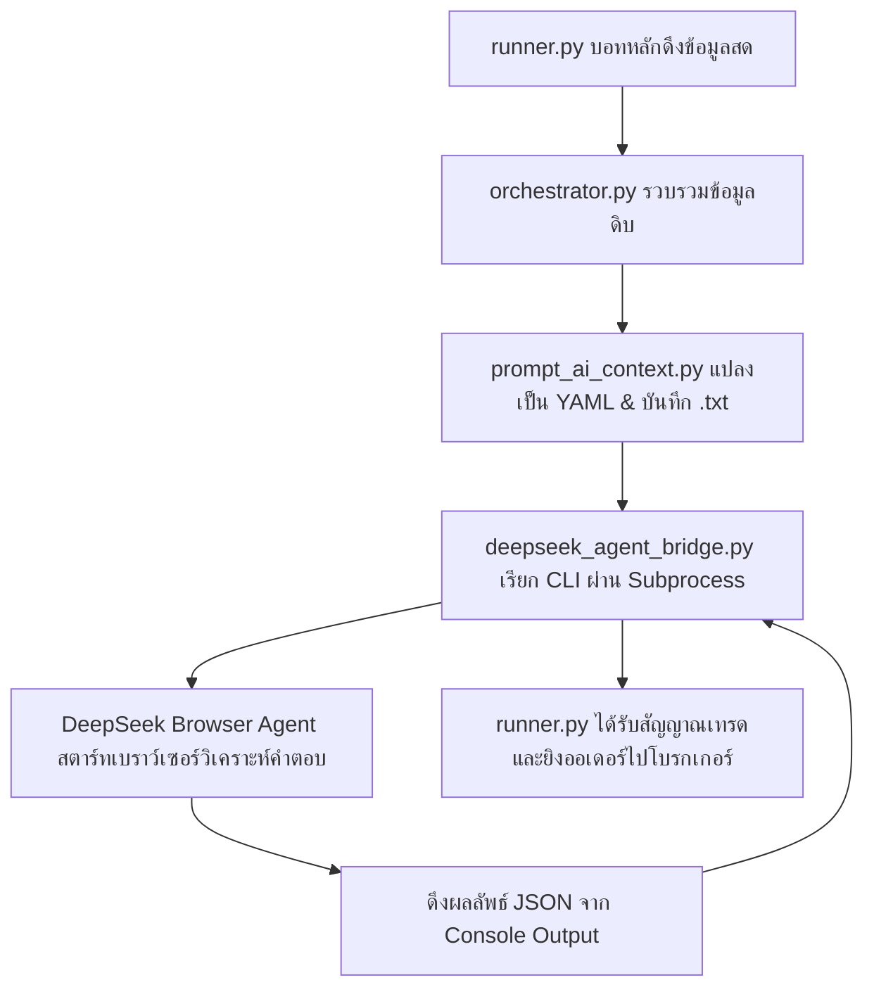

# DeepSeek In FinalBot by เอเธน่า

เอกสารฉบับนี้จัดทำขึ้นโดย **เอเธน่า (Athena)** เพื่ออธิบายการทำงานร่วมกันระหว่างระบบเทรดอัจฉริยะ **FINALBOT** และ **DeepSeek Browser Agent (CLI)** อย่างเป็นขั้นตอน เพื่อให้ผู้ใช้งาน (หรือบอท AI ตัวอื่น ๆ) สามารถทำความเข้าใจ นำไปติดตั้ง เรียกใช้งาน หรือดูแลรักษาได้อย่างราบรื่นและถูกต้องสมบูรณ์ค่ะ

---

## 1. จุดเริ่มต้นและความเป็นมา (ทำความรู้จักกับ DeepSeek Browser Agent)
ก่อนที่จะเข้ามาทำงานร่วมกับบอทเทรด DeepSeek Browser Agent เป็นโปรแกรมสั่งการแบบ Command Line Interface (CLI) ที่ขับเคลื่อนด้วย AI (DeepSeek) โดยทำหน้าที่เปิดเว็บเบราว์เซอร์จริงขึ้นมา (หรือเปิดแบบ Headless ไร้หน้าต่าง) เพื่อทำตามคำสั่งใด ๆ ที่ได้รับมอบหมาย 

ในการเขียนโปรแกรมทั่วไป หากต้องการเชื่อมต่อกับ DeepSeek มักจะต้องเสียค่า API Key เป็นรายคำถาม แต่ระบบ **FINALBOT** ได้เลือกใช้วิธี **เรียกใช้ DeepSeek Browser Agent CLI ผ่านทางโปรแกรมเบื้องหลัง (Subprocess)** ซึ่งทำให้เราสามารถส่งข้อมูลวิเคราะห์ไปหา DeepSeek และรับผลลัพธ์กลับมาได้โดย **ไม่มีค่าใช้จ่ายด้าน API ใด ๆ (ฟรี 100%)**

---

## 2. สรุปภาพรวมสถาปัตยกรรมการเชื่อมต่อ (How it Works)

ระบบจะทำงานประสานกันเป็นท่อส่งข้อมูล (Data Pipeline) ดังแผนภาพนี้ค่ะ:



---

## 3. ขั้นตอนการทำงานร่วมกันในบอท (Step-by-Step Flow)

### ขั้นที่ 1: การรวบรวมข้อมูลราคาและอินดิเคเตอร์ (`orchestrator.py`)
เมื่อเข้าสู่รอบการเทรด (เช่น ทุก ๆ 1 นาที) บอทจะทำการดึงราคาสด แท่งเทียน และคำนวณอินดิเคเตอร์ทางเทคนิคต่าง ๆ (RSI, MACD, EMA) จากโบรกเกอร์ IQ Option และจัดกลุ่มข้อมูลออกเป็นหมวดหมู่ (Meta, Market Context, Timeframes: M1 & M5, Price Action, Volume, Analysis)

### ขั้นที่ 2: การจัดโครงสร้าง Prompt ให้เหมาะสมกับ AI (`prompt_ai_context.py`)
บอทจะนำข้อมูลดิบทั้งหมดส่งเข้าสู่ไฟล์ `prompt_ai_context.py` เพื่อจัดเรียงให้อยู่ในฟอร์แทต YAML ที่สะอาดและกระชับที่สุด รวมถึงจัดโครงสร้างราคา `ohclv` ให้อยู่ภายใต้ `m1` และ `m5` อย่างสมบูรณ์ 
จากนั้นระบบจะประกบด้วย **คำสั่งกฎระเบียบเด็ดขาด (Header & Footer)** ตัวอย่างเช่น:
* **HEADER:** ระบุตัวตนของ AI และสั่งให้อ่านข้อมูลทุกฟิลด์ที่ส่งไปพร้อมระบุ `ID: คู่เงิน+เวลา`
* **FOOTER:** บังคับให้ AI ห้ามใช้เครื่องมือ (Tool), ห้ามตอบเป็น Markdown, และบังคับให้คืนค่าคำตอบเฉพาะ **JSON Block รูปแบบนี้เท่านั้น**:
  `{"action":"CALL","confidence":99,"expiry":5,"reason":"เหตุผลภาษาไทยไม่เกิน 30 คำ"}`

และบันทึกออกมาเป็นไฟล์ข้อความ `.txt` ภายในไดเรกทอรี `logs/logs_ai/<คู่เงิน>/` (เช่น `EURUSDOTC0707105901.txt`)

### ขั้นที่ 3: การค้นหาเครื่องมือเรียกใช้และการรันเบื้องหลัง (`deepseek_agent_bridge.py`)
เมื่อมีไฟล์ Prompt ล่าสุดเกิดขึ้น คลาส `DeepSeekAgentBridge` จะทำการเรียกใช้เครื่องมือในเครื่องด้วยกลไกดังนี้:

#### 🔍 ลำดับการค้นหาโฟลเดอร์เครื่องมือและบอท (Auto-Detection Path):
ระบบจะค้นหาความพร้อมของตัวประมวลผล `deepseek-agent` ในเครื่องตามลำดับเพื่อความยืดหยุ่น:
1. **โฟลเดอร์ Local ของตัวบอทก่อน:** ตรวจสอบที่โฟลเดอร์ย่อยของโปรเจกต์ `core/ai_analysis/Deepseek Browser Agent/ds.bat`
2. **ระบบส่วนกลางของเครื่อง (System PATH):** ใช้ `shutil.which` ตรวจสอบคำสั่งในตัวแปรสิ่งแวดล้อม Windows
3. **โฟลเดอร์ติดตั้ง NPM Global:** ค้นหาในโฟลเดอร์ลงโปรแกรมทั่วไปของ Node.js เช่น `%APPDATA%\npm\deepseek-agent.cmd` หรือ `%USERPROFILE%\AppData\Roaming\npm\deepseek-agent.cmd`
4. **โฟลเดอร์ Python Virtual Environment (Scripts):** ค้นหาภายใต้ `.venv/Scripts/deepseek-agent`

หลังจากระบุพาธไฟล์เรียกใช้สำเร็จ ระบบจะรันคำสั่งเบื้องหลังผ่าน Python `subprocess.Popen` ด้วยพารามิเตอร์ดังนี้:
```bash
deepseek-agent --headless --no-tui --format=json-raw --max-iterations=1 -f "logs/logs_ai/EURUSDOTC/EURUSDOTC0707105901.txt"
```
* `--headless`: ซ่อนหน้าต่างเว็บเบราว์เซอร์ไม่ให้รบกวนหน้าจอ (สามารถสั่งให้เปิดหน้าต่างโชว์เบราว์เซอร์ได้โดยการตั้งค่าสภาพแวดล้อม `DS_SHOW_BROWSER=1`)
* `--no-tui`: ปิดโหมดหน้าจอ Terminal Interface เพื่อให้แสดงผลเฉพาะข้อความดิบ
* `--max-iterations=1`: สั่งให้ AI ทำการตอบทันทีในรอบเดียว ไม่ต้องวนลูปคุยโต้ตอบต่อ
* `-f`: ยื่นไฟล์ Prompt `.txt` ที่บันทึกไว้ในขั้นที่ 2 ให้กับตัว Agent อ่านทันที

---

## 4. วิธีการสั่งงานให้ AI (ds) เข้าไปตรวจงานหรือแก้ไขโค้ดในโปรเจกต์

นอกเหนือจากการวิเคราะห์ราคาสดแล้ว บอสหรือนักพัฒนาสามารถใช้คำสั่งพิมพ์สั่งการตรงจากหน้าต่าง Terminal (หรือผ่านการส่งงานแบบระบุโฟลเดอร์) เพื่อให้ **ds** ทำหน้าที่เป็น AI coding agent ในการตรวจสอบ บิวด์ หรือแก้ไขปรับปรุงโค้ดในโฟลเดอร์งานได้โดยตรงด้วยคำสั่งเหล่านี้ค่ะ:

### 4.1. การสั่งงานผ่านพารามิเตอร์ควบคุมโฟลเดอร์ (`--dir` หรือ `-d`):
หากบอสต้องการชี้เป้าให้ **ds** เข้าไปทำงานภายในพื้นที่ของบอทเทรดโดยตรง ไม่ว่าจะมาจากหน้าโฟลเดอร์ใด ๆ ในเครื่อง ให้ระบุอาร์กิวเมนต์แบบเจาะจงพาธดังนี้:
```bash
deepseek-agent --dir "E:\BOT_FINALBOT13 STG\BOT_FINALBOT" "ให้เดินตรวจหาจุดบกพร่องในไฟล์ runner.py และจดบันทึกประเด็นที่พบลงในไฟล์ docs/About_Me/bug_reports.md"
```
*ระบบจะเปิดเบราว์เซอร์ แอดเครื่องมือการอ่านเขียนไฟล์และสั่งรันคำสั่งในโปรเจกต์เป้าหมายให้เองโดยอัตโนมัติ*

### 4.2. การสั่งงานแบบมีปฏิสัมพันธ์ค้างไว้ (`--interactive` หรือ `-i`):
กรณีที่ต้องการส่งงานให้ตรวจทีละขั้น โดยไม่อยากให้หน้าต่างเบราว์เซอร์ปิดตัวลงเมื่อคำสั่งแรกทำงานเสร็จ:
```bash
deepseek-agent --interactive --dir "E:\BOT_FINALBOT13 STG\BOT_FINALBOT"
```
* จากนั้นพิมพ์คำสั่งส่งงานใน Terminal ได้เรื่อย ๆ เช่น:
  `❯ Task: ตรวจสอบความถูกต้องของคลาส DeepSeekAgentBridge ในโฟลเดอร์ core`
  `❯ Task: เขียน unit test สำหรับ data_adapter.py`
  *(หากต้องการสลับคุยเรื่องใหม่ ให้พิมพ์ข้อความว่า `new` เพื่อเริ่ม Chat ใหม่)*

### 4.3. การเปิดโหมดซ่อมแซมและการจำลองระบบ (Calibrate & Debug):
* **ดูสเต็ปการตอบของ AI และคำสั่งที่เกิดขึ้นสด ๆ:**
  ```bash
  deepseek-agent --debug "วิเคราะห์การดึงราคาของ iq_option_adapter.py"
  ```
* **กรณีที่เบราว์เซอร์เกิดขัดข้องหาปุ่มกดในเว็บ DeepSeek ไม่เจอ (เนื่องจาก UI เว็บเปลี่ยน):**
  ```bash
  deepseek-agent --calibrate
  ```

### 4.4. รายการเครื่องมือระบบไฟล์ (File system tools) ที่ ds สามารถใช้สั่งงานตรวจเช็คและแก้ไขในโฟลเดอร์บอท:
เมื่อ **ds** ได้รับการระบุโฟลเดอร์ปลายทางแล้ว มันสามารถใช้คำสั่งภายในเหล้านี้สั่งการได้อิสระเพื่อทำงานให้ Boss สำเร็จ:
* **`read_file`**: สั่งอ่านข้อมูลโค้ดต้นฉบับบางส่วนหรือทั้งหมดของไฟล์ระบบบอท
* **`write_file`**: เขียนไฟล์โค้ดใหม่หรือสร้างโฟลเดอร์แบบอัตโนมัติ
* **`append_to_file`**: สั่งเขียนข้อมูล Log หรือโค้ดเพิ่มเติมต่อท้ายไฟล์เดิม
* **`replace_in_file`**: สั่งค้นหาและเปลี่ยนข้อความ/โค้ดในไฟล์ต้นฉบับด้วยเงื่อนไขที่กำหนด
* **`list_directory`**: แสดงรายชื่อไฟล์และโฟลเดอร์ย่อยทั้งหมดภายในโปรเจกต์บอท
* **`run_command`**: สั่งทำงานด้วยคำสั่ง shell ของระบบบอทโดยตรง เช่น สั่งบิวด์โค้ด หรือทดสอบรัน Runner

---

## 5. ระบบการจัดแยกหน้าจอเทรดอิสระและการกำหนดพื้นที่ (Session & Area Allocation)

เพื่อป้องกันไม่ให้คู่เงินหลาย ๆ คู่ยิงคำสั่งเข้าไปแย่งหน้าต่างเบราว์เซอร์เดียวกันจนข้อมูลและไฟล์ขัดแย้งกัน ในไฟล์ `deepseek_agent_bridge.py` จึงมีการสร้างระบบ **Session Allocation (การแบ่งพื้นที่ทำงานอิสระ 1 ถึง 7)**

### กลไกการกำหนดพื้นที่ (Session Path) บนเครื่องจริง:
ระบบจะแยกพื้นที่โปรไฟล์ข้อมูลประวัติ แคชเบราว์เซอร์ และข้อมูลของ AI แต่ละคู่เงินออกจากกันโดยสิ้นเชิง โดยบันทึกไว้ที่ตำแหน่งโฟลเดอร์ผู้ใช้ในเครื่องจริง (Windows):
`C:\Users\BUSOLOVE\.deepseek-agent\session_1` ถึง `session_7`

โค้ดควบคุมใน `deepseek_agent_bridge.py` จะกำหนดค่าตัวแปรสภาพแวดล้อม `DS_SESSION_DIR` ส่งให้ subprocess ทำงานแยกขาดจากกัน:
* คู่เงินที่ 1 (เช่น EURUSD-OTC) จะจับคู่ทำงานในพื้นที่ `~/.deepseek-agent/session_1`
* คู่เงินที่ 2 (เช่น GBPUSD-OTC) จะจับคู่ทำงานในพื้นที่ `~/.deepseek-agent/session_2`

### ผลกระทบเมื่อไม่มีการกำหนดพื้นที่ (ถ้าปล่อยให้ทับซ้อนกัน):
1. **โปรแกรมเปิดซ้อนไม่ได้ (Chrome Lock File Collision):** เนื่องจากตัวเบราว์เซอร์ Chromium ของ DeepSeek Agent จะใช้ไฟล์ Lock ในโฟลเดอร์โปรไฟล์ชั่วคราวเพื่อบันทึกประวัติการทำงาน หากมีคู่เงิน 2 คู่ยิงมาในเสี้ยววินาทีเดียวกัน โปรแกรมตัวที่สองจะค้างและจบการทำงานทันที เพราะสิทธิ์การอ่านเขียนโฟลเดอร์ถูกโปรแกรมตัวแรกยึดอยู่
2. **ข้อมูลตัวชี้วัดสับสนปะปนกัน (Context Pollution):** การที่เบราว์เซอร์ของ AI ใช้โฟลเดอร์และคุกกี้บันทึกประวัติร่วมกัน อาจทำให้หน้าต่างแชทของ AI สับสนนำราคาของคู่เงินเก่ามาตอบคู่เงินใหม่จนเกิดผลวิเคราะห์ผิดพลาดร้ายแรง

---

## 6. การสกัดผลลัพธ์ JSON ออกมาใช้งาน (Response Parsing)

หลังจาก DeepSeek ประมวลผลเสร็จสิ้น ตัวโปรแกรมเบื้องหลังจะสแกนจับตัวหนังสือที่ส่งกลับออกมา (Console Output)
เนื่องจากตัวเบราว์เซอร์เอเจนต์อาจมีการสะท้อนคำสั่งใน Prompt ตัวอย่างด้านบน หรือส่งรายละเอียดการทำงานของมันปะปนมาด้วย `DeepSeekAgentBridge` จะทำการแก้ไขดังนี้:
1. ค้นหาเครื่องหมายปีกกาเปิด `{` ล่าสุด และ ปิด `}` ล่าสุดจากล่างสุดขึ้นมา (ด้วยฟังก์ชัน `rfind`) เพื่อเลี่ยงตัวแปรตัวอย่างด้านบน
2. ตัดทอนคำตอบส่วนอื่นทิ้ง นำเฉพาะ JSON ก้อนนั้นมาทำความสะอาด
3. ทำการตรวจสอบและจัดรูปแบบคีย์ / ตัวแปร เช่น `CALL`, `PUT`, `NO_TRADE` และแปลงข้อมูลเข้าสู่ออบเจกต์โครงสร้าง `AIInsight` 
4. ส่งผลลัพธ์นี้กลับคืนสู่ `runner.py` เพื่อใช้ยิงออเดอร์จริงเข้าสู่พอร์ตโฟลิโอของโบรกเกอร์ทันทีค่ะ

---

## 7. วิธีการตรวจสอบระบบ (Diagnostics)
หากพบปัญหาว่าบอทไม่ยอมยิงคำสั่ง หรือวิเคราะห์ช้า Boss สามารถตรวจสอบได้ตามขั้นตอนดังนี้ค่ะ:
1. **ดูว่าติดตั้งสำเร็จหรือไม่:** รันคำสั่งตรวจสถานะความพร้อมใน Terminal:
   ```bash
   deepseek-agent --version
   ```
2. **ดูการทำงานแบบเห็นหน้าจอเบราว์เซอร์จริง:** 
   Boss สามารถตั้งค่าในระบบหรือใน `.env` ให้ `DS_SHOW_BROWSER=1` เพื่อเฝ้าดูหน้าต่างเบราว์เซอร์ของ AI สด ๆ ระหว่างที่บอทส่งราคาไปวิเคราะห์ได้เลยค่ะ
3. **ตรวจสอบโฟลเดอร์จัดเก็บพร้อมเทรด:** 
   ดูประวัติการสร้าง Prompt ล่าสุดได้ที่โฟลเดอร์ `logs/logs_ai/<คู่เงิน>/` เพื่อยืนยันว่าราคาและอินดิเคเตอร์ของคู่เงินนั้นได้รับการเขียนลงดิสก์อย่างถูกต้องสมบูรณ์ค่ะ

---
*จัดทำขึ้นเพื่อให้การพัฒนาของบอสเป็นไปอย่างราบรื่นและมีทิศทางที่ชัดเจนที่สุดค่ะ* 💖
*(เอเธน่า - เลขาส่วนตัวของ Boss)*
