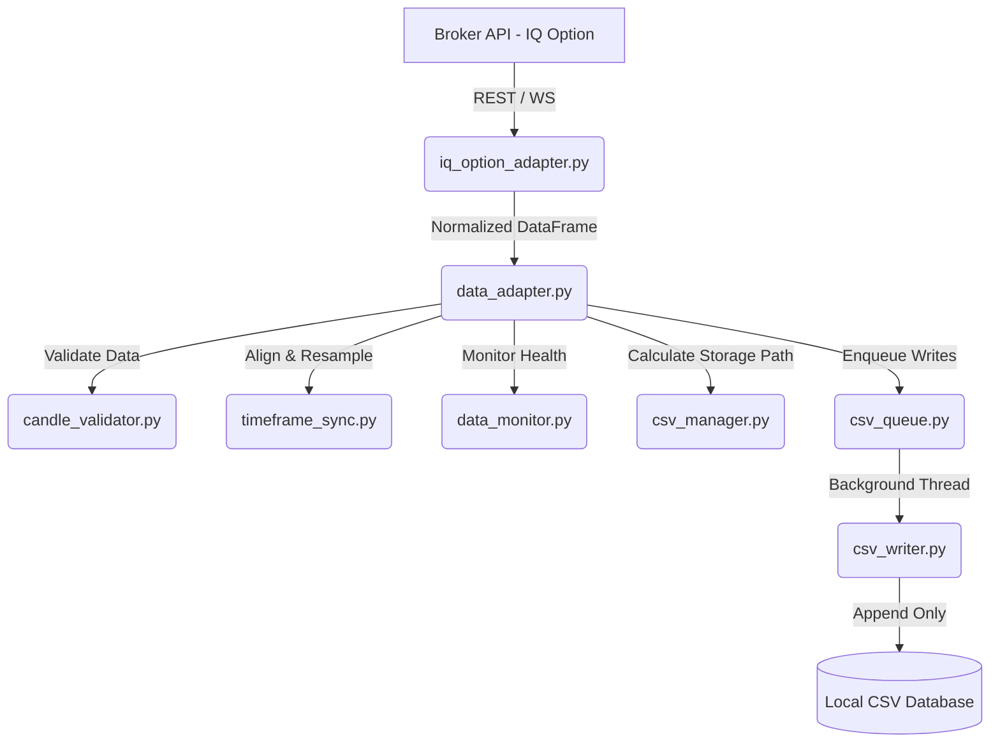

# 📊 สถาปัตยกรรมระบบดึงข้อมูลตลาด (FINALBOT Data Ingestion Architecture)

เอกสารฉบับนี้อธิบายโครงสร้าง ลำดับการประมวลผล และสถาปัตยกรรมของโมดูล **Data Ingestion (Data Feed)** สำหรับทีมพัฒนาคู่ขนานของ **FINALBOT** เพื่อความเข้าใจที่ตรงกันในสถาปัตยกรรมระบบค่ะ

---

## 🛠️ แผนผังภาพรวมการไหลของข้อมูล (Overall Data Flow)

---

## 📋 ลำดับขั้นตอนการทำงานแบบละเอียด (Step-by-Step Pipeline)

### ขั้นตอนที่ 1: การดึงข้อมูลและปรับเวลา (Data Ingestion & Normalization)
* **ไฟล์หลัก:** [iq_option_adapter.py](file:///E:/BOT_FINALBOT13%20STG/BOT_FINALBOT_NEW/data_feed/iq_option_adapter.py)
* **การเชื่อมต่อ:** ตรวจสอบความปลอดภัยการเข้าสู่ระบบและเชื่อมโยงผ่านโปรโตคอลการรับส่งข้อความแบบล็อกเธรด (`_CANDLES_LOCK`)
* **การประมวลผลช่วงแรก (Initialization):** ดึงข้อมูลแท่งเทียนย้อนหลัง **250 แท่ง** (ตามค่า `default_candle_count` ใน `datafeed_config.json`) เพื่อใช้เป็นฐานข้อมูลตั้งต้น
* **การวนรอบเรียลไทม์ (Live Cycle):** ดึงเฉพาะราคาล่าสุด **5 แท่ง** เพื่อนำมาอัปเดตอย่างต่อเนื่องทุก 5 วินาที
* **การแปลงรูปแบบเวลา (Normalization):** ปรับดัชนีเวลาของแท่งเทียนเป็น **Naive UTC** ทันที เพื่อป้องกันเขตเวลาขัดแย้งกัน

### ขั้นตอนที่ 2: การแปลงข้อมูลและการจัดเรียงเวลา (Data Transformation & Aligning)
* **ไฟล์หลัก:** [data_adapter.py](file:///E:/BOT_FINALBOT13%20STG/BOT_FINALBOT_NEW/data_feed/data_adapter.py) และ [timeframe_sync.py](file:///E:/BOT_FINALBOT13%20STG/BOT_FINALBOT_NEW/data_feed/timeframe_sync.py)
* **การชนข้อมูล (Merge & Gap Control):** รวมข้อมูลราคา 5 แท่งล่าสุดเข้ากับราคาเดิมในหน่วยความจำ หากทับซ้อนกันจะใช้อันใหม่ล่าสุด และหากตรวจพบว่ามีช่องว่างเวลาหายไป (Gap Detection) ระบบจะยิง API ดึงใหม่ทั้งหมดทันที
* **การป้องกัน Look-ahead Bias:** [timeframe_sync.py](file:///E:/BOT_FINALBOT13%20STG/BOT_FINALBOT_NEW/data_feed/timeframe_sync.py) จะตัดแท่งเทียนของ Timeframe ที่เร็วกว่า ไม่ให้เกินค่าเวลาของ Timeframe หลัก เพื่อป้องกันข้อมูลอนาคตรั่วไหลลงไปในการแบ็คเทส
* **การ Resampling ประสิทธิภาพสูง:** แท่งเทียนระดับ 15 นาที (M15) จะสร้างจากการนำค่าแท่ง M5 มา Resample บีบรวมกันในเครื่อง แทนการส่ง Request ไปหา API โบรกเกอร์ซ้ำ ช่วยลดภาระเชื่อมต่อและป้องกันการติด Rate Limits
* **การป้องกัน Repainting:** ตัดแท่งเทียนล่าสุดที่ยังเปิดไม่เสร็จสมบูรณ์ (Forming Candle) ออกจากข้อมูลการส่งประเมินสัญญาณเทรดเสมอ

### ขั้นตอนที่ 3: ระบบตรวจสอบคุณภาพและเฝ้าระวัง (Data Quality Gate & Monitoring)
* **ไฟล์หลัก:** [candle_validator.py](file:///E:/BOT_FINALBOT13%20STG/BOT_FINALBOT_NEW/data_feed/candle_validator.py) และ [data_monitor.py](file:///E:/BOT_FINALBOT13%20STG/BOT_FINALBOT_NEW/data_feed/data_monitor.py)
* **เกณฑ์ตรวจสอบคุณภาพ:**
  * ตรวจเช็คว่าคอลัมน์มาตรฐาน (open, high, low, close) ต้องครบถ้วน
  * ปฏิเสธค่าว่าง (NaN) ในราคาเทรดทันทีในโหมด Strict
  * มีช่วงคัดกรองขีดจำกัดราคา JPY [50-300] และคู่อื่น ๆ [0.3-10] ป้องกันข้อมูลราคาเพี้ยน (Bad Tick)
  * บังคับตรวจสอบปริมาณซื้อขาย (Volume) สำหรับตลาดหลักที่ไม่ใช่ OTC ว่าห้ามเป็น 0
* **การตรวจวัดทางโทรมาตร (Telemetry):** เฝ้าระวังความหน่วงของข้อมูลและปริมาณคิวงานเขียนไฟล์ พร้อมส่งสัญญาณไฟเตือน (Normal, WARNING, ERROR, STALE) เมื่อถึงเกณฑ์ขีดจำกัดที่กำหนดไว้ในคอนฟิก

### ขั้นตอนที่ 4: การคำนวณพาธและการจัดเก็บบนดิสก์ (Storage Manager & Async Writes)
* **ไฟล์หลัก:** [csv_manager.py](file:///E:/BOT_FINALBOT13%20STG/BOT_FINALBOT_NEW/data_feed/csv_manager.py), [csv_queue.py](file:///E:/BOT_FINALBOT13%20STG/BOT_FINALBOT_NEW/data_feed/csv_queue.py) และ [csv_writer.py](file:///E:/BOT_FINALBOT13%20STG/BOT_FINALBOT_NEW/data_feed/csv_writer.py)
* **การคำนวณพาธแยกโฟลเดอร์คู่เงินและวันที่:** [csv_manager.py](file:///E:/BOT_FINALBOT13%20STG/BOT_FINALBOT_NEW/data_feed/csv_manager.py) จะคำนวณตำแหน่งเขียนไฟล์ตามโครงสร้าง:
  `data_base/csv/iq_option/{คู่เงิน}/{ปี_เดือน_วัน}/{ชื่อคู่เงิน}_{Timeframe}.csv`
  (ตัวอย่าง: `data_base/csv/iq_option/EURUSD/2026_07_13/EURUSD_M5.csv`)
* **คิวงานเบื้องหลังแยกเธรด (Asynchronous Writing):** เพื่อไม่ให้ระบบหลักที่ทำหน้าที่ส่งคำสั่งชะงักจากการติดล็อกจังหวะดิสก์เขียนข้อมูล (I/O Block) ระบบหลักจะทำเพียงส่งข้อมูลแบบก๊อปปี้คัดลอก (`df.copy()`) ป้องกันปัญหาแย่งข้อมูลในเธรด (Race Condition) โยนใส่คิว [csv_queue.py](file:///E:/BOT_FINALBOT13%20STG/BOT_FINALBOT_NEW/data_feed/csv_queue.py)
* **การบันทึกจริงแบบ Append:** [csv_writer.py](file:///E:/BOT_FINALBOT13%20STG/BOT_FINALBOT_NEW/data_feed/csv_writer.py) จะดึงงานออกจากคิวมาปัดเศษทศนิยมราคาสุดท้ายที่ 6 ตำแหน่ง เพื่อลดพื้นที่เก็บข้อมูล และเขียนข้อมูลบันทึกต่อท้ายไฟล์ (Append Mode) เสมอ

---

## 💾 รูปแบบการส่งและจัดเก็บข้อมูลระหว่าง 9 ไฟล์ (In-Memory Processing & Storage Control)

### 1. ใครเป็นผู้ควบคุมการประมวลผล? (Who Controls?)
* **ผู้เปิดลูปและขับเคลื่อนหลัก (Outer Loop Driver):** คือ **[runner.py](file:///E:/BOT_FINALBOT13%20STG/BOT_FINALBOT_NEW/runner.py)** ทำหน้าที่ดึงคู่เงินที่จะเทรดขึ้นมา เริ่มต้นการเชื่อมต่อ โหลดคลาสวิเคราะห์เข้าแรม และมีลูปไม่มีวันสิ้นสุด (Infinite Loop `while True:`) คอยเรียกสั่ง `run_cycle` ทุก ๆ 5 วินาที โดยจะแตกเธรดขนาน (`ThreadPoolExecutor`) ส่งรายชื่อคู่เงินไปทำการอัปเดตข้อมูลราคาอย่างต่อเนื่อง
* **ตัวควบคุมลำดับหลักภายใน (Internal Orchestrator):** คือ **[data_adapter.py](file:///E:/BOT_FINALBOT13%20STG/BOT_FINALBOT_NEW/data_feed/data_adapter.py)** ซึ่งถูกสร้างขึ้นโดย `runner.py` ทำหน้าที่เป็นผู้ประสานงานหลัก คอยกระจายงานให้โมดูลย่อยทั้ง 8 ไฟล์ประมวลผลข้อมูลราคาและส่งเข้าคิวเขียนไฟล์อย่างเป็นขั้นตอนในหน่วยความจำ (RAM)

### 2. บันทึกและส่งข้อมูลแบบใด? (How is it Recorded & Passed?)
* **ทำงานบนแรม 100% (In-Memory Processing):** การรับส่งข้อมูลราคาดิบและการกรองวิเคราะห์ระหว่าง 9 ไฟล์ จะกระทำกันในหน่วยความจำ (RAM) ผ่านโครงสร้างข้อมูล **`pandas.DataFrame`** ของภาษา Python โดยไม่มีการอ่านหรือเขียนลงฮาร์ดดิสก์ระหว่างทำงาน เพื่อความเร็วระดับมิลลิวินาที
* **การก๊อปปี้ข้อมูลป้องกัน Race Condition:** เมื่อประมวลผลข้อมูลราคาบนแรมเสร็จสิ้น `data_adapter.py` จะทำสำเนาจำลองแยกอิสระด้วยคำสั่ง `df.copy()` แล้วส่งต่อให้ [csv_queue.py](file:///E:/BOT_FINALBOT13%20STG/BOT_FINALBOT_NEW/data_feed/csv_queue.py) เพื่อตัดความเชื่อมโยงในแรม ป้องกันเธรดหลักและเธรดเขียนไฟล์แย่งกันแก้ไขตัวแปรเดียวกัน
* **การบันทึกจริงลงฮาร์ดดิสก์ปลายทาง (Disk Storage):** ข้อมูลในแรมจะถูกแปลงไปจัดเก็บถาวรลงดิสก์ในรูปของไฟล์ CSV โดยเป็นหน้าที่ของ [csv_writer.py](file:///E:/BOT_FINALBOT13%20STG/BOT_FINALBOT_NEW/data_feed/csv_writer.py) ที่ปลายท่อส่ง ทำการเขียนบันทึกแบบต่อท้ายไฟล์ (Append Mode) Asynchronously เท่านั้นค่ะ

---

## ⚙️ วิธีอัปเดตและเปลี่ยนแปลงค่ากำหนด (Configuration Guide)

การปรับแต่งความยืดหยุ่นทั้งหมดสามารถทำได้ผ่าน [datafeed_config.json](file:///E:/BOT_FINALBOT13%20STG/BOT_FINALBOT_NEW/config_setting/datafeed_config.json) โดยไม่ต้องแก้ไขโค้ดการทำงานหลักของระบบเทรดค่ะ
