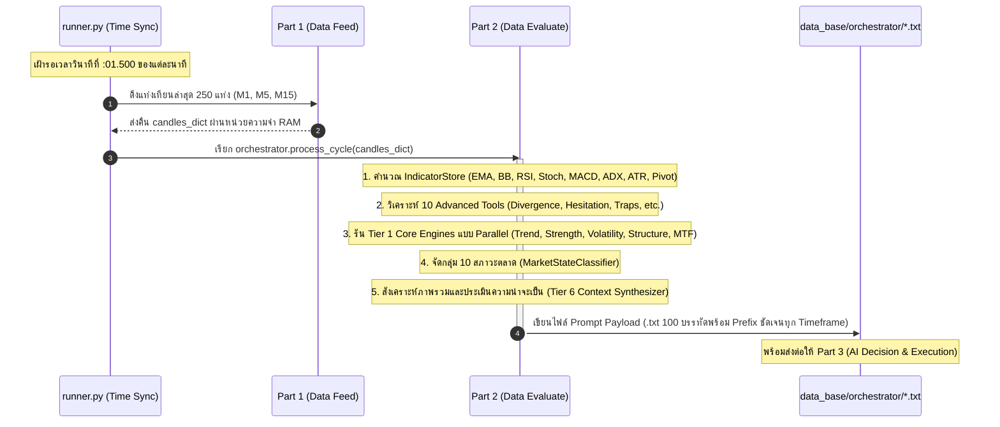

# FINALBOT — ระบบเทรดอัตโนมัติอัจฉริยะ (Trading Bot System)

## 📌 ภาพรวมสถาปัตยกรรมระบบ

FINALBOT แบ่งโครงสร้างการทำงานออกเป็น 3 ส่วนหลัก (3-Stage Pipeline):

| ส่วน | ชื่อส่วนงาน | หน้าที่หลัก | สถานะ |
|:---|:---|:---|:---:|
| **Part 1** | **Data Feed System** | เชื่อมต่อโบรกเกอร์ (IQ Option) → ดึงและจัดระเบียบข้อมูล OHLCV (M1, M5, M15) → ตรวจสอบคุณภาพและบันทึก CSV | ✅ เสร็จสมบูรณ์ |
| **Part 2** | **Data Evaluation & Orchestration** | รับแท่งเทียนเข้าสู่ RAM → คำนวณ Indicators & 10 Advanced Tools → ประมวลผล Tier 1-6 Engines → สร้าง Prompt Payload (.txt 100 บรรทัด) | ✅ เสร็จสมบูรณ์ |
| **Part 3** | **AI Decision & Execution** | ส่ง Prompt ให้ AI วิเคราะห์ตัดสินใจ CALL / PUT → ส่งสัญญาณเข้าสู่ระบบยิงออเดอร์และบริหารเงินทุน | ⏳ ขั้นตอนถัดไป |

---

## 🏗️ โครงสร้างโฟลเดอร์โปรเจกต์ (Project Tree)

```text
FINALBOT_Begin/
├── main.py                     # Entry point (ทดสอบเริ่มต้น)
├── runner.py                   # ตัวควบคุมวงรอบหลัก (PureAIRunner) ทำงานรายวินาที
├── .env                        # Credentials & API Keys
├── .agents/                    # กฎ วินัย และคู่มือ AI
│   └── AGENTS.md               # กฎวินัยสูงสุด (Rule 1-21)
├── config_setting/             # การตั้งค่าระบบ
│   ├── settings.json           # ตั้งค่าบัญชี, สินทรัพย์ (โหลดตรงอิสระตามสั่งบอส), ขีดจำกัดความเสี่ยง
│   ├── config_loader.py        # ตัวโหลดการตั้งค่า
│   └── symbol_mapper.json      # การแปลงชื่อสัญลักษณ์
├── data_feed/                  # [Part 1] ระบบรับส่งข้อมูลจากโบรกเกอร์ (ห้ามแตะต้องโค้ดโดยเด็ดขาด)
│   ├── data_adapter.py         # Coordinator หลักของ Data Feed
│   ├── data_processor.py       # จัดเรียงแท่งเทียน, คำนวณ Age (ms) & Quality (FRESH/STALE)
│   ├── data_validator.py       # ตรวจสอบความถูกต้องของข้อมูล
│   ├── data_cache_store.py     # แคชข้อมูลใน RAM
│   ├── csv_manager.py          # จัดการและจัดเก็บไฟล์ CSV (8 คอลัมน์มาตรฐาน)
│   └── bridge_adapter/         # ตัวเชื่อมต่อโบรกเกอร์ (IQ Option)
├── data_evaluate/              # [Part 2] ระบบสมองกลวิเคราะห์และประเมินข้อมูล
│   ├── orchestrator.py         # 👑 ผู้คุมวงรอบการประมวลผล 8 ขั้นตอน & สร้างไฟล์ Prompt 100 บรรทัด (Retention: 30 ไฟล์ล่าสุด)
│   ├── orchestration/
│   │   ├── indicator_store/    # การคำนวณอินดิเคเตอร์พื้นฐาน (SSOT)
│   │   ├── advanced_tools/     # 10 เครื่องมือวิเคราะห์พฤติกรรมและ Price Action
│   │   └── market_classifier/  # Tier 1-6 Engines และ Market State Classifier
│   └── decision_layer/         # ชั้นเชื่อมโยงและบันทึกประวัติการตัดสินใจ
├── data_base/                  # คลังข้อมูลผลลัพธ์
│   ├── csv/iq_option/          # ไฟล์ประวัติราคา OHLCV
│   └── orchestrator/           # ไฟล์ Prompt Payload (.txt 100 บรรทัด) แยกตามคู่เงิน (จำกัด 30 ไฟล์ล่าสุด)
└── docs/                       # เอกสารคู่มือระบบฉบับสมบูรณ์
```

---

## ⚡ วงรอบการทำงาน (Execution Lifecycle)



---

## 🛡️ มาตรฐานความถูกต้องและกฎวินัย (Quality Assurance)

1. **Single Source of Truth (SSOT):** ไม่มีการคำนวณอินดิเคเตอร์ซ้ำซ้อน ทุกโมดูลใช้ข้อมูลอ้างอิงจากจุดเดียวกัน
2. **Fail-Fast & Zero Mocks:** ไม่มีการใช้ข้อมูลหลอก หรือกลืน Error ด้วย `try-except` ว่าง หากข้อมูลไม่พร้อมระบบจะหยุดทันที
3. **Pure Foreground CMD Testing:** ทดสอบผ่าน `runner.py` และตรวจไฟล์ผลลัพธ์จริงเสมอ
4. **100-Line Explicit Schema:** ทุกฟิลด์ใน Prompt ถูกระบุ Timeframe ชัดเจน (`m1_`, `m5_`, `m15_`, `m5_pa_`, `m5_`, `mtf_`, `dl_`, `ai_`)
5. **Auto Retention Policy:** ระบบกำจัดไฟล์ Prompt เก่าอัตโนมัติ โดยรักษาไว้สูงสุดไม่เกิน 30 ไฟล์ต่อคู่เงิน ป้องกันดิสก์เต็ม
