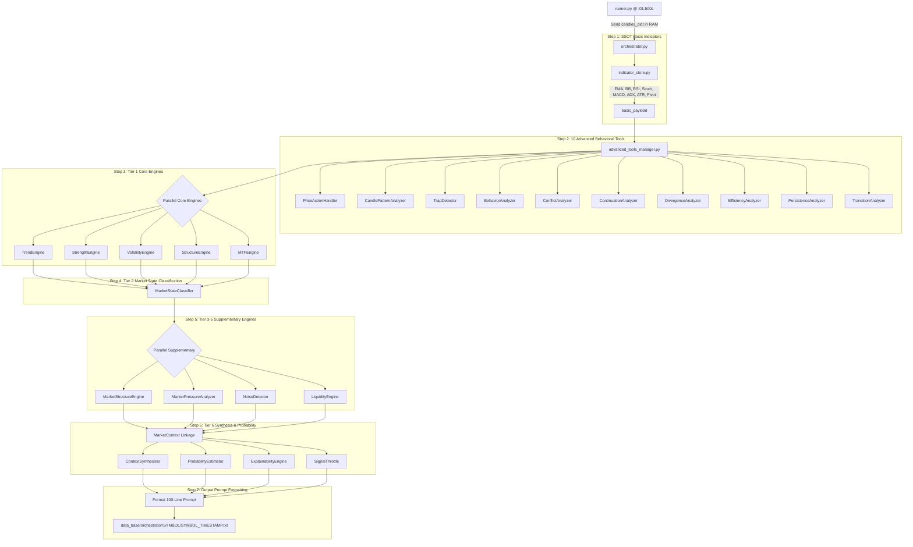

# 🧠 FINALBOT - กระบวนการทำงานของบอท ส่วนที่ 2: PROCESS (Data Evaluate)

## 🎯 ทำความเข้าใจได้ทันที
ส่วนงานที่ 2 (PROCESS) คือ **"สมองกลวิเคราะห์ข้อมูลและมิติพฤติกรรมตลาด"** ที่ตั้งอยู่ในโฟลเดอร์ `data_evaluate/` มีหน้าที่รับข้อมูลแท่งเทียน (M1, M5, M15) จาก RAM ผ่าน `runner.py` มาคำนวณผ่านอินดิเคเตอร์, 10 เครื่องมือวิเคราะห์พฤติกรรมขั้นสูง (Advanced Tools) และระบบ Tier 1-6 Engines เพื่อสร้างเป็น **"แพ็กเกจข้อมูล Prompt Payload ความยาว 100 บรรทัด (.txt)"** สำหรับส่งต่อให้ AI (ส่วนที่ 3) นำไปตัดสินใจ โดยส่วนงานที่ 2 จะทำหน้าที่ "วิเคราะห์และรายงานผล" เท่านั้น จะไม่มีการตัดสินใจยิงออร์เดอร์ใดๆ ทั้งสิ้น

---

## 🏗️ โครงสร้างหลักของโปรเจกต์และขอบเขตส่วนงาน

**โครงสร้างหลักของโปรเจกต์:**
- `runner.py` คือผู้ควบคุมทิศทางและจับจังหวะเวลารายวินาที
- `config_setting/` คือโฟลเดอร์สำหรับเก็บไฟล์การตั้งค่าทั้งหมด
- `data_feed/` คือระบบดึงและตรวจสอบข้อมูล OHLCV (ส่วนที่ 1)
- `data_evaluate/` คือระบบสมองกลประมวลผลข้อมูลและพฤติกรรม (ส่วนที่ 2)
- `data_base/orchestrator/` คือคลังเก็บไฟล์ผลลัพธ์ Prompt Payload 100 บรรทัด

---

## 🚨 กฎการทำงานและกติกาข้อบังคับ (Strict Rules)

1. **ดึงข้อมูลจากแหล่งเดียว (Single Source of Truth):**
   - การคำนวณอินดิเคเตอร์พื้นฐานทำที่ `indicator_store.py` ครั้งเดียว แล้วส่งต่อให้โมดูลอื่นใช้งานร่วมกัน ไม่มีการคำนวณซ้ำซ้อน

2. **กฎการแตกหัก (Fail-Fast Policy & No Silent Failures):**
   - หากเจอข้อผิดพลาดของข้อมูลหรือคำนวณไม่ได้ ระบบต้องหยุดและแจ้งข้อผิดพลาดทันที ห้ามกลืน Error ด้วย `try-except` ว่างเด็ดขาด

3. **ห้ามมี Mock เด็ดขาด (No Mocks & Real Implementation):**
   - ทุกค่าต้องคำนวณจากคณิตศาสตร์และแท่งเทียนจริง ห้ามใช้ข้อมูลจำลองหรือค่าสุ่มหลอกระบบ

4. **ไม่ใช่ผู้ตัดสินใจขั้นสุดท้าย (Analysis Only):**
   - หน้าที่ของส่วนงานที่ 2 สิ้นสุดเมื่อสร้างเอกสาร Prompt Payload 100 บรรทัดสำเร็จ โดยในหมวด `decision_layer:` จะคงสถานะเป็น "รอการวิเคราะห์จาก AI"

---

## 🏗️ แผนผังสถาปัตยกรรมการประมวลผล 8 ขั้นตอน

---

## 📄 โครงสร้างไฟล์ Prompt Payload 100 บรรทัด (Standard Format)

ไฟล์ผลลัพธ์ที่สร้างขึ้นจะถูกบันทึกที่ `data_base/orchestrator/{SYMBOL}/{SYMBOL}{TIMESTAMP}.txt` โดยมีโครงสร้างมาตรฐาน 100 บรรทัด แบ่งออกเป็น 7 หมวดหมู่หลัก:

1. **`meta:`** (ข้อมูลจำเพาะสินทรัพย์, เวลา, คุณภาพแท่งเทียน)
2. **`market_context:`** (สภาวะตลาด 10 รูปแบบ, ระดับความผันผวน, ข่าว)
3. **`timeframes:`** (ข้อมูลอินดิเคเตอร์และราคาเปิด/ปิดของ M1, M5, M15)
4. **`price_action:`** (แพทเทิร์นแท่งเทียน, Divergence Alert, ความลังเล, ความคุ้มค่าของเส้นทาง)
5. **`volume:`** (Volume Momentum และการกระจายตัวของปริมาณการซื้อขาย)
6. **`analysis:`** (ทิศทางเทรนด์, โอกาสการไปต่อของเทรนด์ %, ความเสี่ยงเปลี่ยนสภาวะ, ความต่อเนื่องของโมเมนตัม)
7. **`decision_layer:`** (ระดับความเสี่ยง, คะแนนเสถียรภาพ และข้อความรอรับการวิเคราะห์จาก AI)

---

## 🛡️ สถานะระบบและการทดสอบ (System Verification)
- **การทดสอบ:** รันสดผ่าน `runner.py`
- **ความเร็วในการประมวลผล:** ทำงานเสร็จสิ้นภายใน 0.2-0.5 วินาทีต่อ 4 คู่เงิน
- **ความสมบูรณ์:** ผ่านการทดสอบระดับบรรทัด ไร้จุดคำนวณซ้ำซ้อน และพร้อมส่งต่อให้ Part 3 ใช้งาน 100%
