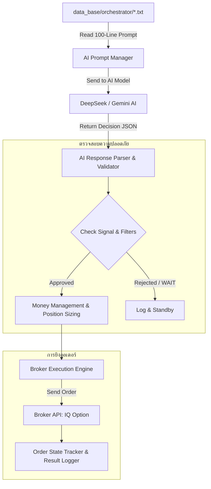

# 🎯 FINALBOT - กระบวนการทำงานของบอท ส่วนที่ 3: OUTPUT (AI Decision & Execution)

## 📌 ภาพรวมสถาปัตยกรรมส่วนที่ 3 (Overview)
ส่วนงานที่ 3 (**OUTPUT / AI Decision & Execution System**) คือ **"ระบบสมองกลตัดสินใจขั้นสุดท้ายและการบริหารจัดการออเดอร์"** มีหน้าที่รับไฟล์ Prompt Payload มาตรฐาน 100 บรรทัด (.txt) จากส่วนงานที่ 2 (PROCESS) เพื่อส่งให้ AI วิเคราะห์ตัดสินใจเลือกทิศทาง (CALL / PUT), กำหนดเวลาหมดอายุ (Expiry 1-5 นาที), และส่งคำสั่งเข้าสู่ระบบยิงออเดอร์ตามกฎการบริหารความเสี่ยงและเงินทุน (Money Management)

---

## 🏗️ โครงสร้างขอบเขตงานส่วนที่ 3 (Planned Workflow)

---

## 📋 หน้าที่หลักของโมดูลในส่วนที่ 3

1. **AI Prompt Dispatcher & Interface:**
   - อ่านไฟล์ Prompt `.txt` ล่าสุดของแต่ละคู่เงิน
   - จัดส่งให้โมเดล AI (DeepSeek / Gemini) ประมวลผลแบบ Real-time

2. **Decision Parser & Signal Validator:**
   - ถอดรหัสผลการตัดสินใจของ AI (Action: CALL / PUT / WAIT, Expiry, Confidence, Reason)
   - ตรวจสอบความถูกต้องและขจัดสัญญาณขัดแย้งตามเงื่อนไขความปลอดภัย

3. **Money Management & Position Sizing:**
   - คำนวณขนาดเงินลงทุนต่อไม้ (Fixed Amount / Compound / Martingale / Fractional Sizing)
   - ควบคุมขีดจำกัดความเสี่ยงรายวัน (Daily Drawdown / Profit Target / Circuit Breaker)

4. **Trade Execution & Order Management:**
   - ส่งคำสั่งเทรดไปยังโบรกเกอร์ (IQ Option) แบบเสี้ยววินาที
   - ติดตามผลลัพธ์การเทรด (Win / Loss / PnL) และบันทึกลงในระบบ Memory Manager และ Report

---

## ⏳ สถานะปัจจุบัน
- **สถานะ:** ⏳ เตรียมพร้อมเริ่มพัฒนาในขั้นตอนถัดไป (Pending Development)
- **ความพร้อมของระบบรองรับ:** ข้อมูลจาก Part 1 (Data Feed) และ Part 2 (Data Evaluate) เสร็จสมบูรณ์ 100% พร้อมเชื่อมต่อทันที
